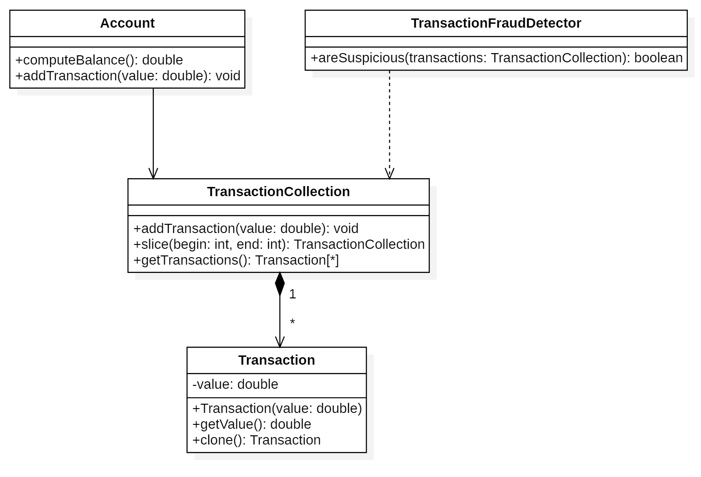
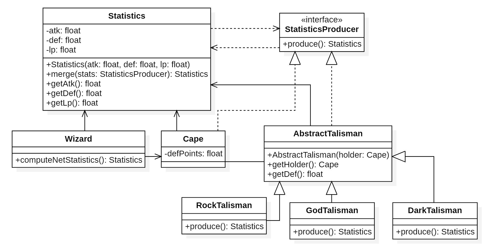
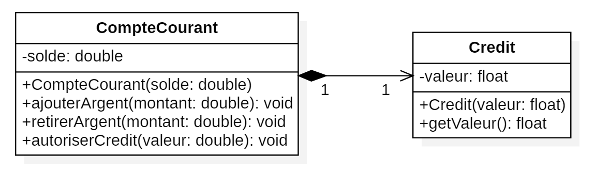
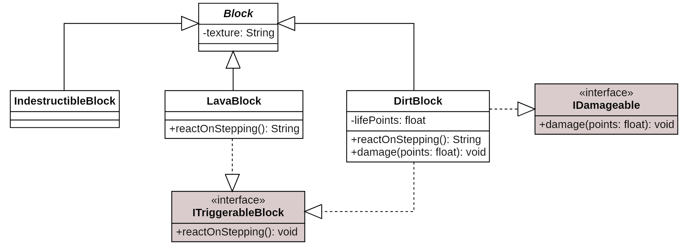
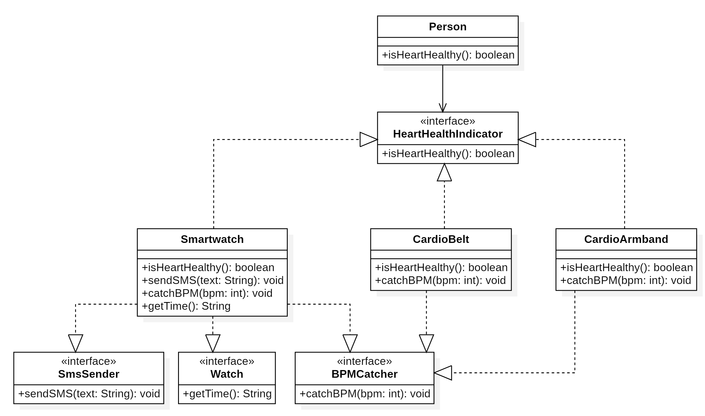

# BAC 3 - Analyse et conduite de projet

## SOLID
### Single Responsibility Principle (SRP)

##### Image Copyright &copy; Orlando Palermo [Github](https://github.com/PalermoOrlando)

### Open-Closed Principle (OCP)

##### Image Copyright &copy; Orlando Palermo [Github](https://github.com/PalermoOrlando)

### Liskov Substitution Principle (LSP)

##### Image Copyright &copy; Orlando Palermo [Github](https://github.com/PalermoOrlando)

### Interface Segregation Principle (ISP)

##### Image Copyright &copy; Orlando Palermo [Github](https://github.com/PalermoOrlando)

### Dependency Inversion Principle (DIP)

##### Image Copyright &copy; Orlando Palermo [Github](https://github.com/PalermoOrlando)
